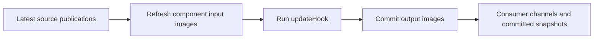

# Automatic cyclic data ports

RTT 3 gives each component stable input and output images. Component code accesses
those images, and its execution engine transfers samples around `updateHook()`.
This is a breaking change under development on `feat/automatic-cyclic-io`.

> The feature remains unmerged. Use a complete feature build in a private prefix;
> rebuild components, typekits, OCL, generators, and transports together. RTT 2
> plugins must not appear in the feature process's `RTT_COMPONENT_PATH`.

## Component code

Keep `RTT::TaskContext`, `RTT::Service`, and the normal port registration interface.
There is no additional component base class and no manual I/O mode.

```cpp
struct Input { double x{}, y{}; };
struct Output { double y{}, z{}; };

class Controller : public RTT::TaskContext {
    RTT::InputPort<Input> input{"input"};
    RTT::OutputPort<Output> output{"output"};
public:
    explicit Controller(const std::string& name) : RTT::TaskContext(name) {
        addPort(input);
        addPort(output);
    }
    void updateHook() override {
        const auto& in = input.data();
        auto& out = output.data();
        out.y = in.y * 2.0;
        out.z = in.x + in.y;
    }
};
```

Use `data()` in the owning component's hooks and lifecycle code. These are direct
references to component storage; asynchronous observers use `snapshot()` or the
transport observation API. No channel transfer occurs when accessing `data()`.

Register typekit metadata for these structures to connect individual members.
Whole supported values can connect without member metadata. Ports require types
with value semantics: copying a pointer or nonowning view does not copy its target.

The input reference is const. The output reference is mutable and belongs to the
component's execution context. Neither access transfers data. Public port `read`,
`readNewest`, and `write` methods and their script wrappers have been removed.



The engine commits outputs only after the hook returns successfully while the
component remains in Running. An exception, error transition, or requested stop
prevents that hook's output publication. Input images keep their previous values
when no new sample arrives. Before the first sample, they contain configured or
value-initialized defaults; the engine still calls the hook.

`input.status()` reports `NoData`, `NewData`, or `OldData` from the latest input
boundary. Repeated observation does not consume or clear freshness. `NewData`
means a new publication was acquired, even when its value equals the previous one.

## Execution scheduling

An activity or an external scheduler determines when the component executes.
Port data arrival does not schedule a component cycle. Each scheduled cycle
refreshes all registered inputs, runs `updateHook()`, and publishes all outputs,
including ports in nested services.

For example, configure a 10 Hz activity in the deployment before startup:

```text
setActivity("controller", 0.1, 0, ORO_SCHED_OTHER)
```

`addEventPort()`, port-specific callbacks, and port-driven OroGen models are
removed. Register every data input with `addPort()` and explicitly select an
activity or external execution source. A nonperiodic component needs an explicit
trigger or scheduler invocation for subsequent cycles; receiving a sample alone
will not run its hook. Operation and transport scheduling remain separate from
data-port publication.

For an OroGen model that previously used `port_driven "input"`, choose its
execution schedule explicitly, for example:

```ruby
task_context "Controller" do
    input_port "input", "double"
    output_port "output", "double"
    periodic 0.1
end
```

Lua components also use `addPort`; `rttlib.create_if` accepts `in` and `out` port
specifications and rejects the removed `in+event` form.

## Deployment connections

Use `connectPort(source, destination)` for both whole values and members. Its
endpoints use exactly the same dot/index paths as TaskBrowser data expressions:

| Connection | Deployment operation |
|---|---|
| Whole output to whole input | `connectPort("A.output", "B.input")` |
| Member to member | `connectPort("A.output.y", "B.input.y")` |
| Whole scalar to member | `connectPort("C.value", "B.input.x")` |
| Member to whole scalar | `connectPort("A.output.z", "D.value")` |
| Nested member or fixed-array element | `connectPort("A.motion.output.axes[2].position", "B.input.target.position")` |

The resolver walks actual services to a registered port, then selects data
members or constant indices. A bare port selects its whole value. Whole-port
connections require matching whole types. Member connections require matching
selected types, so `Output.y` can connect to `Input.y` although the parent
structures differ. The output is always first and the input second.

The separate `connectMember` and deprecated `connectTwoPorts` deployment
operations are removed, along with the four-argument C++
`DeploymentComponent::connectPorts` overload. The earlier experimental `::`
selector notation is rejected; use dots and fixed indices throughout.

For the component types above, a complete wiring fragment after loading the
components is:

```text
setActivity("A", 0.1, 0, ORO_SCHED_OTHER)
setActivity("C", 0.1, 0, ORO_SCHED_OTHER)
setActivity("B", 0.1, 0, ORO_SCHED_OTHER)
connectPort("A.output.y", "B.input.y")
connectPort("C.output.z", "B.input.x")
finalizeConnections()
startComponent("A")
startComponent("C")
startComponent("B")
```

This assembles `B.input` from two sources. Each destination region has exactly one
writer. A whole-input writer overlaps every member writer, and a selected parent
structure overlaps all its children. Such combinations are rejected.

Selectors support nested members and constant fixed-array indices, for example
`axes[2].position`. A selected nested structure or whole fixed array can also be
connected when the types and shapes match. Dynamic container element selectors
are rejected; whole dynamic values remain typed values. Fixed arrays embedded in
owning structures are supported; nonowning `carray` wrappers cannot be root port
images.

Invalid paths, legacy `::` selectors, negative or out-of-range indices, type
mismatches, array-shape mismatches, and overlapping writers fail configuration. Matching storage size
alone does not make two types compatible, and numeric conversions are not implicit.

## Ports in services

Register a port through a service and attach that service to the component:

```cpp
auto motion = provides("motion");
auto feedback = motion->provides("feedback");
feedback->addPort(input);
```

Use `B.motion.feedback.input` as its deployment port path. Root and nested service
ports participate in the same owning component cycle. The runtime resolves the
service tree and member paths before activation and prepares flat execution lists.

Stop all affected components before changing the graph or storage shape.
`finalizeConnections()` validates the declarations explicitly; startup also
requires a prepared valid graph. Operation-only service changes do not change the
port graph. Detaching a port-containing service removes its affected connections.

The explicit deployer call is optional: `startComponent()` prepares the component's
connections automatically before entering its start hook. Use the explicit call
when you want to check all component connections before starting any component.

## Inspect and manage ports

Ports are runtime objects with type, direction, values and connections. They do
not create synthetic services or management operations under their names. Actual
component services remain services. TaskBrowser reads port data directly:

```text
A.output
A.output.y
B.input.x
A.motion.output.axes[2].position
```

These expressions are read-only. A data member named `data`, `snapshot`,
`connected` or `name` remains an ordinary data member. There is no required
`.data` or `.snapshot` wrapper. Input reads show configured defaults and then the
last image acquired by the component. Output reads show the last committed
publication, which is unavailable until the first commit.

Use separate deployer operations for whole-port management:

```text
isPortConnected("B.input")
disconnectPort("B.input")
```

Both operations require a whole port path. Stop affected components before
disconnecting; this removes all mappings into the selected whole input. Use `ls`
or `help` to inspect direction, type, value and source relationships.

## Inspect input connections

In the deployer's TaskBrowser, `ls B` lists the component's root ports and
`ls B.motion.feedback` lists ports in that service. Each connected input has
source rows underneath its value. For the wiring fragment above, `ls B` includes:

```text
       input.x <- C.output.z
       input.y <- A.output.y
```

Each row names the destination port or member on the left and the fully
qualified source port or member on the right. A whole-port connection has no
member suffix. Nested structures and array indices retain their selectors,
such as `input.axes[2].position`. Rows are ordered by destination selector,
then source endpoint. `help` for a service shows the same source rows.

These rows describe the current runtime graph, including disconnects and
replacement connections. Inspection does not consume samples or refresh input
images. It runs in the browser, outside the component update cycle. A connected
transport that cannot expose its source identity displays `<source unavailable>`.

## Realtime behavior and observation

The added cyclic work consists of prepared transfers and typed assignments.
Fixed types with bounded copy operations can run without heap allocation after
preparation. Dynamically allocated whole types require representative
`setDataSample()` values and sufficient capacity on both endpoints before startup;
resizing during execution can allocate. Type copying, transport, synchronization,
and scheduling still determine timing on the target platform.

Data ports use latest-value delivery. For example, if a producer publishes 10,
20, and 30 before the next consumer cycle, that cycle can acquire 30; the channel
does not retain the intermediate samples for later cycles. Public FIFO and
circular-buffer data-port modes and their construction helpers are removed.
Scripts, generators, and transport policy decoding reject the removed modes;
an old buffered configuration is not silently changed to latest-value delivery.

A whole input has one source. Two outputs cannot both supply the same whole
input or overlapping input members, including through a shared DATA channel.
Multiple sources can still populate disjoint members or fixed-array elements,
and one output can supply many inputs. Use a component with separate inputs and
an explicit selection rule when several producers represent alternative sources.

Internal operation, logging, and network queues remain part of the
runtime. POSIX mqueue retains its transport queue; `ConnPolicy.size` specifies
transport capacity where supported. `buffer_policy` continues to describe data
storage placement and sharing, and does not select FIFO delivery. Shared storage
tracks freshness separately for each cyclic input, so one reader cannot consume
another component's update. A publication concurrent with acquisition may be
observed on the following cycle or reported again; latest-state delivery does
not provide exactly-once event delivery. `UNBUFFERED`
is reserved for output streams. Discrete commands belong in operations; event
counts or bounded batches can represent events in state data. Data ports do not
provide event callbacks or publication-driven component wakeups.

Each component has its own boundary. Fields from different producers may come
from different producer cycles. Several fields mapped from one source use one
source subscription snapshot when assembling the destination. There is no global
all-input/all-hook/all-output scheduler barrier.

TaskBrowser, reporting, OPC UA, and HTTP observe acquired input images and
committed output images. Each observer
has independent freshness and does not consume the component's input channel.
Observer storage is bounded. If slow observers occupy every snapshot slot, the
cache retains an older committed value while channel delivery continues; observation
can coalesce updates and does not backpressure the component cycle.
Network ingress stages samples for the destination's next input boundary, including
when a request arrives while its hook is running. Staging acknowledgement does not
mean the component has already processed the value.

Lua component hooks use `input:data()` and `output:data(value)`. Lua returns detached
image copies; output image assignment is committed by the owner cycle. Native RTT
scripts use the same read-only dot/index expressions and component-defined
attributes or operations. The old port-event state-machine shorthand has been removed.

OCL timers expose cumulative `UInt64` expiration counters. Reporting samples each
source once per report and may coalesce intermediate publications. See the OCL
`doc/automatic-cyclic-io.md` guide for timer and reporting details.

See [Cyclic I/O validation](cyclic-io-validation.md) for measured costs and validation limits.

## External input sources

HTTP and OPC UA publication is passive and read-only by default. It adds no
connections, so connected or running ports can be published without changing
their input sources. Network serialization runs outside the component cycle.

Enable a network writer explicitly after publishing the target and while the
component is stopped:

```text
http.enableInputWrite("B.input.x")
opcua.enableInputWrite("B.input.y")
```

These sources can coexist because they claim disjoint regions. Claiming the
whole input, the same member twice through different sources, or an overlapping
parent region is rejected. Outputs cannot accept external writes. Both services
also provide `disableInputWrite(endpoint)` during stopped configuration.

A successful request stages the selected typed value. Reads continue to show the
previous acquired image until the next input boundary. Requests to one enabled
source update its latest state; they do not create a writer per client. HTTP
exposes selected member routes; OPC UA creates a typed member Variable when a
region is enabled and keeps it read-only after disabling. See the
[HTTP](http-reference.md) and [OPC UA](opcua-reference.md) references for paths.
