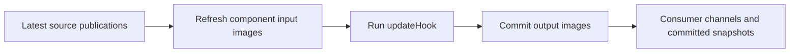

# Automatic cyclic data ports

RTT 3 gives each component stable input and output images. Component code accesses
those images, and its execution engine transfers samples around `updateHook()`.
This is a breaking change under development on `feat/automatic-cyclic-io`.

> The feature remains unmerged. Use a complete feature build in a private prefix;
> rebuild components, typekits, OCL, generators, and transports together. RTT 2
> plugins must not appear in the feature process's `RTT_COMPONENT_PATH`.

## Component code

Keep `RTT::TaskContext`, `RTT::Service`, and the normal port registration interface.
There is no additional component base class and no manual I/O mode.

```cpp
struct Input { double x{}, y{}; };
struct Output { double y{}, z{}; };

class Controller : public RTT::TaskContext {
    RTT::InputPort<Input> input{"input"};
    RTT::OutputPort<Output> output{"output"};
public:
    explicit Controller(const std::string& name) : RTT::TaskContext(name) {
        addPort(input);
        addPort(output);
    }
    void updateHook() override {
        const auto& in = input.data();
        auto& out = output.data();
        out.y = in.y * 2.0;
        out.z = in.x + in.y;
    }
};
```

Register typekit metadata for these structures to connect individual members.
Whole supported values can connect without member metadata. Ports require types
with value semantics: copying a pointer or nonowning view does not copy its target.

The input reference is const. The output reference is mutable and belongs to the
component's execution context. Neither access transfers data. Public port `read`,
`readNewest`, and `write` methods and their script wrappers have been removed.



The engine commits outputs only after the hook returns successfully while the
component remains in Running. An exception, error transition, or requested stop
prevents that hook's output publication. Input images keep their previous values
when no new sample arrives. Before the first sample, they contain configured or
value-initialized defaults; the engine still calls the hook.

`input.status()` reports `NoData`, `NewData`, or `OldData` from the latest input
boundary. Repeated observation does not consume or clear freshness. `NewData`
means a new publication was acquired, even when its value equals the previous one.

## Deployment connections

Use service-qualified port paths and separate member selectors:

| Connection | Deployment operation |
|---|---|
| Whole output to whole input | `connectPort("A.output", "B.input")` |
| Member to member | `connectMember("A.output", "y", "B.input", "y")` |
| Whole scalar to member | `connectMember("C.value", "", "B.input", "x")` |
| Member to whole scalar | `connectMember("A.output", "z", "D.value", "")` |

An empty selector means the whole port value. Whole-port connections require
matching whole types. Member connections require matching selected types, so
`Output.y` can connect to `Input.y` although the parent structures differ.

For the component types above, a complete wiring fragment after loading the
components is:

```text
connectMember("A.output", "y", "B.input", "y")
connectMember("C.output", "z", "B.input", "x")
finalizeConnections()
startComponent("A")
startComponent("C")
startComponent("B")
```

This assembles `B.input` from two sources. Each destination region has exactly one
writer. A whole-input writer overlaps every member writer, and a selected parent
structure overlaps all its children. Such combinations are rejected.

Selectors support nested members and constant fixed-array indices, for example
`axes[2].position`. A selected nested structure or whole fixed array can also be
connected when the types and shapes match. Dynamic container element selectors
are rejected; whole dynamic values remain typed values. Fixed arrays embedded in
owning structures are supported; nonowning `carray` wrappers cannot be root port
images.

Invalid paths, negative or out-of-range indices, type mismatches, array-shape
mismatches, and overlapping writers fail configuration. Matching storage size
alone does not make two types compatible, and numeric conversions are not implicit.

## Ports in services

Register a port through a service and attach that service to the component:

```cpp
auto motion = provides("motion");
auto feedback = motion->provides("feedback");
feedback->addPort(input);
```

Use `B.motion.feedback.input` as its deployment port path. Root and nested service
ports participate in the same owning component cycle. The runtime resolves the
service tree and member paths before activation and prepares flat execution lists.

Stop all affected components before changing the graph or storage shape.
`finalizeConnections()` validates the declarations explicitly; startup also
requires a prepared valid graph. Operation-only service changes do not change the
port graph. Detaching a port-containing service removes its affected connections.

## Realtime behavior and observation

The added cyclic work consists of prepared transfers and typed assignments.
Fixed types with bounded copy operations can run without heap allocation after
preparation. Dynamically allocated whole types require representative
`setDataSample()` values and sufficient capacity on both endpoints before startup;
resizing during execution can allocate. Type copying, transport, synchronization,
and scheduling still determine timing on the target platform.

State channels use latest-value delivery. Component FIFO inputs and multiple
whole-port writers are rejected. Discrete commands belong in operations; event
counts or bounded batches can represent events in state data. An EventPort wakeup
does not promise one hook invocation for every publication.

Each component has its own boundary. Fields from different producers may come
from different producer cycles. Several fields mapped from one source use one
source subscription snapshot when assembling the destination. There is no global
all-input/all-hook/all-output scheduler barrier.

TaskBrowser, reporting, OPC UA, and HTTP observe committed snapshots. Each observer
has independent freshness and does not consume the component's input channel.
Observer storage is bounded. If slow observers occupy every snapshot slot, the
cache retains an older committed value while channel delivery continues; observation
can coalesce updates and does not backpressure the component cycle.
Network ingress stages samples for the destination's next input boundary, including
when a request arrives while its hook is running. Staging acknowledgement does not
mean the component has already processed the value.

Lua component hooks use `input:data()` and `output:data(value)`. Lua returns detached
image copies; output image assignment is committed by the owner cycle. Native RTT
scripts can use observation operations and component-defined attributes or
operations. The old port-event state-machine shorthand has been removed.

OCL timers expose cumulative `UInt64` expiration counters. Reporting samples each
source once per report and may coalesce intermediate publications. See the OCL
`doc/automatic-cyclic-io.md` guide for timer and reporting details.

See [Cyclic I/O validation](cyclic-io-validation.md) for measured costs and validation limits.
