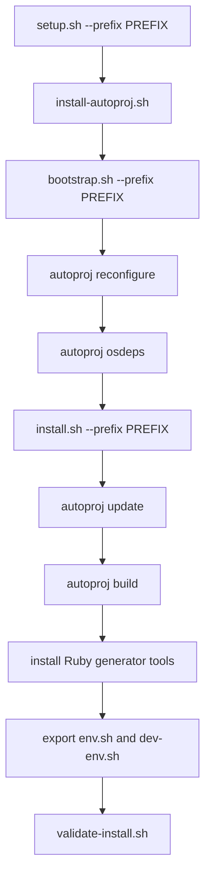
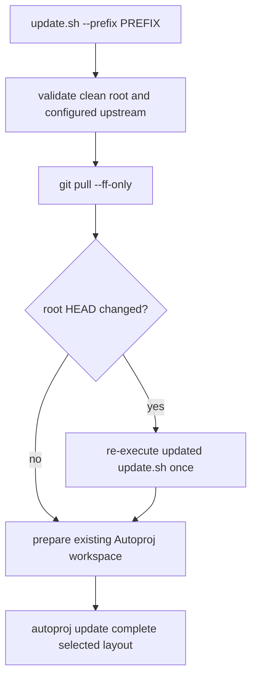

# Maintaining The Toolchain

This page is for people who maintain the `orocos-rock` dependency workspace.
The maintainer's job is to produce one installed Orocos/Rock prefix that
downstream projects can consume as a normal third-party dependency.

## Maintainer Principles

- The install prefix is the public contract.
- `.autoproj/`, package checkouts, and build directories are workspace state.
- Package selection belongs in tracked Autoproj configuration.
- Fork choices belong in tracked overrides.
- Public maintenance forks use branch pins recorded in `autoproj/overrides.yml`.
- Wrapper scripts should make the workflow repeatable, not hide new policy.
- Changes to `rock-orocos` land through pull requests. Do not push directly to
  `main` during normal maintenance.

## Documentation Lifecycle

The mdBook is the stable public documentation for the supported toolchain.

- Guides and reference chapters describe current shipped behavior only.
- Approved but unimplemented work belongs below `docs/src/todo/` and must say
  that it is outside the current install contract.
- When planned work ships, move its durable contract into a guide or reference
  chapter and delete the TODO page.
- Delete completed implementation plans after preserving current behavior and
  repeatable verification requirements.
- Do not commit workflow artifacts below `docs/superpowers/`, generated
  `docs/book/` output, temporary paths, or one-time execution transcripts.
- Add every Markdown page below `docs/src/` to `SUMMARY.md`.
- Build docs through `pixi run --locked -e docs docs-build`; CI validates the
  same command but does not currently publish the output to GitHub Pages.

Current source and the installed-prefix contract take precedence over stale
design text.

## Script Flow

| Script | What it does | Main output |
|---|---|---|
| `tools/setup.sh` | User-facing wrapper that runs Autoproj install, bootstrap, install, and validation in order; `--skip-osdeps` is reserved for controlled dependency environments | A validated installed prefix |
| `tools/update.sh` | Fast-forwards the root and updates the complete configured Autoproj layout without building or installing | Updated source checkouts |
| `tools/install-autoproj.sh` | Installs Autoproj into the current user's RubyGems area if `autoproj` is not already usable | User gem executables, usually under RubyGems' user bin directory |
| `tools/bootstrap.sh` | Generates local Autoproj workspace config, runs `autoproj reconfigure`, and optionally installs OS dependencies | `.autoproj/config.yml`, `.autoproj/Gemfile`, `.autoproj/bin/*`, refreshed package-set state |
| `tools/install.sh` | Updates forked packages, refreshes source-declared OS dependencies, builds the selected package layout, stages Ruby generator tools, and exports environment scripts | Built packages under the configured prefix plus `env.sh` and `dev-env.sh` |
| `tools/export-env.sh` | Regenerates prefix environment scripts without rebuilding packages | `PREFIX/env.sh`, `PREFIX/dev-env.sh` |
| `tools/validate-install.sh` | Sources the exported environments and checks required runtime and generator commands | A pass/fail validation of the installed prefix |
| `tools/docker-build.sh` | Builds the clean-room Docker image using the tracked Dockerfile | Local Docker image, default tag `orocos-rock:latest` |

The build scripts accept `--target gnulinux|xenomai`. The default is
`gnulinux`, preserving the current CI behavior. The selected target is exported
by the generated prefix environment, so reinstalling the same prefix with a
different target switches that prefix to the new target.

## Install Sequence



The production default prefix is `~/.orocos`. Host CI and local verification
must use a fresh prefix below `/tmp` (CI uses `/tmp/orocos`) so they do not
install into or test a maintainer's production prefix. The final clean-room
Docker image uses `/opt/orocos`; this distribution image prefix is separate
from host validation. In Docker builds, root is used only for OS package
installation, `ubuntu` user creation, and ownership setup. The wrapper scripts
run as the `ubuntu` user.

The native CI workflow runs the wrapper scripts in standard Linux containers.
The required CI matrix currently covers Ubuntu 22.04, Ubuntu 24.04, and Debian
13/Trixie. Ubuntu 26.04 is tracked as the next compatibility target once the CI
runtime is available and validated.

The clean-room Docker workflow is manual-only. It remains useful for local image
validation and release-style smoke tests, but it is not the primary PR gate.

The Docker image is multi-stage. Autoproj, source checkouts, build directories,
and `/opt/orocos-rock` exist only in the builder stage. The final image copies
the installed prefix, keeps the OS and Ruby packages needed to use that prefix,
and validates that `deployer-gnulinux`, `orogen`, and `typegen` work without an
Autoproj workspace.

## Update-Only Sequence

`tools/update.sh` is separate from the install sequence. It accepts the same
`--prefix` and `--target` selectors, but stops after updating source checkouts:



The script does not duplicate a package list. `autoproj/manifest` and the
tracked overrides determine the selected packages, branches, tags, and
organization-specific forks. It disables configuration, Bundler, Autoproj,
and osdeps updates, and never invokes a build, install, reset, force-reset, or
stash operation.

Root preflight requires a clean named branch with a configured upstream. A
root fast-forward may complete before a package update fails; the independent
Git repositories are intentionally not treated as a transaction and completed
updates are not rolled back.

## What Gets Installed Or Changed

| Layer | Installed or generated content | Owner | Notes |
|---|---|---|---|
| OS packages | Build tools, CMake, Boost libraries, XML tools, Ruby, Python, `pkg-config`, and package-specific Autoproj osdeps such as ncurses development headers | System package manager | `bootstrap.sh` and `install.sh` may invoke `autoproj osdeps`, which can call `sudo apt-get install` |
| User RubyGems | Autoproj and compatibility gems such as Facets when needed | Current user | `install-autoproj.sh` does not edit shell startup files; it prints a `PATH` line if needed |
| Workspace state | `.autoproj/config.yml`, `.autoproj/Gemfile`, `.autoproj/bin/bundle`, package-set remotes, generated Autoproj state | `orocos-rock` workspace | Generated state. Do not commit it |
| Source checkouts and builds | Autoproj-managed package checkouts and build results for `farbot`, `rtlog-cpp`, `rtt`, `open62541`, `open62541pp`, `rtt_opcua`, `ocl`, and the generator stack | `orocos-rock` workspace and install prefix | Package list starts in `autoproj/manifest` |
| Install prefix | `PREFIX/toolchain`, `PREFIX/bin`, `PREFIX/lib*`, `PREFIX/share`, `PREFIX/env.sh`, `PREFIX/dev-env.sh`, and staged Ruby generator tools | Public toolchain prefix | This is what downstream projects should consume |
| Logs | `PREFIX/log` and Autoproj logs | Local install prefix | Useful for debugging failed osdeps, build, and install steps |

## Environment Scripts

| Script | Purpose | Variables it sets or prepends |
|---|---|---|
| `env.sh` | Runtime environment for deployer and installed components | `OROCOS_PREFIX`, `PATH`, `LD_LIBRARY_PATH`, `CMAKE_PREFIX_PATH`, `PKG_CONFIG_PATH`, `RTT_COMPONENT_PATH`, `TYPELIB_PLUGIN_PATH`, `OROCOS_TARGET` |
| `dev-env.sh` | Development environment for downstream builds and generators | Sources `env.sh`, then sets `GEM_HOME`, `GEM_PATH`, and `RUBYLIB` for installed Ruby generator tooling |

`env.sh` and `dev-env.sh` prepend paths only when the target directory exists.
They are designed to be sourced repeatedly without duplicating path entries.

## Tracked Policy Inputs

| File | Responsibility |
|---|---|
| `autoproj/manifest` | Selected package layout |
| `autoproj/overrides.yml` | Package source overrides and maintained fork URLs |
| `autoproj/*.autobuild` | Local package definitions not present in the imported package sets |
| `autoproj/overrides.rb` | Autoproj package setup hooks |
| `autoproj/manifests/*.xml` | Local package manifest metadata needed during bootstrap |
| `docs/src/package-policy.md` | Human-readable package and fork policy |

Before adding a package, update the policy first and confirm that the focused
RTT/OCL/generator toolchain really needs the package to build or run.

## Maintainer Validation

After changing scripts, package policy, or Docker support, run:

```bash
ruby tools/check-repository-policy.rb
ruby tools/check-autoproj-policy.rb
ruby tools/check-clean-room-docker.rb
bash tools/test-autoproj-launcher.sh
bash tools/test-install-env-transaction.sh
bash tools/test-update.sh
bash tools/test-workspace-env-nounset.sh
bash -n tools/common.sh tools/bootstrap.sh tools/install.sh tools/update.sh tools/test-update.sh
bash -n tools/export-env.sh tools/validate-install.sh
bash -n tools/setup.sh tools/docker-build.sh
```

After changing CI policy, run:

```bash
ruby tools/check-native-ci.rb
ruby tools/check-package-tests-ci.rb
ruby tools/check-windows-package-ci.rb
ruby tools/check-linux-package-ci.rb
ruby tools/check-docs.rb
```

After a real install, run:

```bash
./tools/validate-install.sh --prefix ~/.orocos
```

This validates the selected local deployer, the target-specific OPC UA
deployer and TaskBrowser client, `rtt_opcua` pkg-config metadata, and the Ruby
generator tools. CORBA remains disabled by `rtt_corba_implementation: none`.

Then validate a downstream package by sourcing `~/.orocos/dev-env.sh` before
configuring it.

For a Xenomai 3 variant, select the target explicitly. The default build is a
no-CORBA build and should not require OmniORB:

```bash
export XENOMAI_DIR=/usr/xenomai
export XENOMAI_ROOT_DIR=/usr/xenomai
export PATH="$XENOMAI_DIR/bin:$PATH"

./tools/setup.sh --prefix ~/.orocos --target xenomai
```

If RTT or OCL Xenomai fixes are still local and uncommitted, do not run the
source-updating wrapper. Use the no-update workflow in
[Xenomai 3 Integration](./xenomai3-integration.md).

The target-machine smoke checks are:

```bash
/usr/xenomai/bin/xeno-config --version
/usr/xenomai/bin/xeno-config --skin=native --cflags
source ~/.orocos/env.sh
echo "$OROCOS_TARGET"
deployer-xenomai --version
latency
xeno-test -p 10
```

See [Xenomai 3 Integration](./xenomai3-integration.md) for the RTT patch gates
and target-machine validation guidance.

Package construction, source locking, immutable artifacts, and OIDC release
permissions are defined separately in
[Packaging And Release](./release-guide.md).
