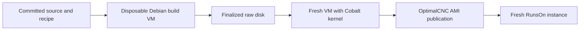

# Debian 13 Xenomai Image

The `rock-orocos-xenomai` image contains a bootable Debian 13 system, the
Xenomai Cobalt kernel and SDK, the Orocos Xenomai development prefix, the real
IgH EtherCAT userspace library, and the RunsOn runner bootstrap. Downstream
projects source the installed development environment and build their own
components. They do not rebuild these dependencies during runner startup.

## Installed Contract

| Payload | Installed location |
|---|---|
| Cobalt kernel, configuration and initramfs | `/boot` and `/lib/modules/<kernel-release>` |
| Xenomai SDK, `xeno-config`, `smokey` | `/usr/xenomai` |
| Orocos runtime and development environment | `/opt/orocos/env.sh`, `/opt/orocos/dev-env.sh` |
| Orocos libraries, headers and deployers | `/opt/orocos/toolchain` |
| EtherLab headers and real userspace library | `/opt/etherlab/include/ecrt.h`, `/opt/etherlab/lib/libethercat.so` |
| Image source identity and package inventory | `/usr/local/share/rock-orocos-image` |

Activate the installed toolchain with:

```bash
source /opt/orocos/dev-env.sh
test "$OROCOS_TARGET" = xenomai
xeno-config --version
deployer-xenomai --version
```

Standalone C++ consumers include `<rtt/os/main.h>` and use `ORO_main` as
their entrypoint, or explicitly pair `__os_init` with `__os_exit`. RTT must
initialize the calling thread before the application creates `TaskContext`
objects or starts its HTTP server.

The `runner` account has UID 1001 and belongs to the `xenomai` group, GID
4242. Boot arguments, device permissions, PAM limits and systemd limits give
that account Cobalt access, unlimited locked memory, and real-time priority
up to 99. The device rules include `/dev/rtp*` for XDDP's ordinary Linux
endpoints. Validation runs as this account.

EtherLab is built with its real userspace library enabled and kernel modules,
fake userspace library, and service installation disabled. This supplies the
software backend for consumers whose tests disable hardware access. Physical
EtherCAT and HIL qualification remain separate from image acceptance.

## CPU Isolation On RunsOn

The image targets four online logical CPUs (`0-3`). The measured
`m7i.xlarge` topology has two physical cores: CPUs `0,2` share one core and
CPUs `1,3` share the other. The instance size is selected by the consumer's
RunsOn workflow; it is not a property of the AMI.

| Work | Logical CPUs |
|---|---|
| Linux services, runner, builds and default interrupts | `0,2` |
| Reserved core | `1,3` |
| Application real-time task and latency measurement | `3` |
| Cobalt-supported CPUs | `0,3` (`0x9`) |

The GRUB drop-in preserves the base image's console arguments and adds:

```text
nowatchdog irqaffinity=0,2 isolcpus=managed_irq,domain,1,3 nohz_full=1,3 rcu_nocbs=1,3 xenomai.supported_cpus=0x9 xenomai.allowed_group=4242
```

Systemd's default CPU affinity is `0,2`. Applications must explicitly set
their RT task affinity to CPU 3; isolation does not move an application
there. The Cobalt example uses `rt_task_set_affinity` when `XENOMAI_RT_CPU`
is set, and checks both primary mode and the CPU reported by Cobalt. CPU 1
is reserved so ordinary work does not compete on CPU 3's hardware sibling.
The pinned Cobalt kernel requires CPU 0 in its supported mask.

> [!IMPORTANT]
> CPU numbering is a machine contract. Acceptance checks the online CPUs,
> SMT siblings, boot arguments, scheduler/tick isolation, default IRQ mask,
> systemd/runner affinity and Cobalt group/mask against `manifest.json`.
> A topology that shares the RT core with housekeeping fails acceptance.
> Choose a new profile before using a different instance topology.

The supplied kernel disables `CONFIG_CPU_IDLE` and `CONFIG_ACPI_PROCESSOR`.
The image does not add `intel_idle.max_cstate`, `processor.max_cstate`,
`idle=poll` or `pcie_aspm=off`. The latter two require separate hardware
measurements. `nowatchdog` disables Linux lockup detectors; the configured
Cobalt watchdog remains enabled. Managed IRQ avoidance is best effort, so
this profile is not a guarantee that every interrupt has been removed.

RunsOn acceptance records two 60-second Xenomai `latency` measurements at
a 1 ms period and priority 80: first with no added load, then with SHA-256
workers on both housekeeping CPUs. Logs preserve the minimum, average,
maximum, overruns and mode switches. They are observations, not a hard
real-time qualification or an invented latency threshold. Physical-machine
and EtherCAT/HIL qualification remain separate.

## Recipe Inputs

| Component | Source reference | Fixed commit |
|---|---|---|
| Linux/Dovetail | `Xenomai/linux-dovetail`, `v6.12.85-cip22-dovetail3-rebase` | `4ee2a3e14885adcb41c428dd42d16f6cbb0224e0` |
| Xenomai kernel integration and SDK | `liufang-robot/xenomai`, `stable/v3.3.x` | `97192f0deea20b0f0a15359e3cd0a4499e2b9d40` |
| EtherLab | `etherlab.org/ethercat`, `1.6.12` | `381577314d1bedc14e156512616f6dd31fb52c88` |

The recipe verifies SHA-256 digests for these source archives. The base image
is Debian 13 genericcloud amd64 build `20260914-2601`, verified against its
published SHA-512 digest. Actions runner and RunsOn bootstrap versions and
digests are fixed in `images/recipes/runner-inputs.sh`.

`images/recipes/xenomai-cobalt/kernel.config` preserves the supplied kernel
configuration with SHA-256
`1b124bff0bcb03a1d7fa2060f4fe6d986ee2685a2777bf77e460ee8454369ca4`.
The recipe integrates the pinned Cobalt source, runs `olddefconfig` with
Debian's GCC 14, and saves the effective configuration under `/boot`. Required
Dovetail, Xenomai and RTIPC options must remain enabled. Modular NVMe, ext4,
virtio and ENA support is included in the initramfs.

Orocos uses the current committed root checkout and
`packaging/source-lock.json`. The builder stages these with `git archive`;
local caches, credentials and build trees are excluded. The existing
source-lock helper pins Autoproj dependencies and verifies their resolved
commits after installation. OS packages are obtained from Debian's configured
repositories; `packages.tsv` records their installed versions. This is a
recipe with fixed source inputs, not a claim of bit-identical disk output.

## Build And Boot Validation



The host needs Python 3.12 or newer, Packer 1.16.0 with QEMU plugin 1.1.6,
QEMU, OVMF, cloud-image-utils, xorriso and OpenSSH tools. A Linux host with
read/write access to `/dev/kvm` provides acceleration. The guest is Debian
regardless of the host distribution.

The default build VM has four CPUs and 8 GiB RAM. The root disk is 32 GiB and
the separate disposable build disk is 96 GiB; both are sparse. The supplied
configuration includes full kernel debug information and many modules, so
reserve backing disk space and host memory accordingly. Source and debug
build files are removed after installation and the disposable disk is never
published.

Commit recipe and toolchain changes before building. From the repository root:

```bash
cd images
packer init build/image.pkr.hcl
python3 -m build.image --recipe recipes --output .local/build \
  --cpus 4 --memory-mib 8192
python3 -m validate.image --image .local/build/disk.raw \
  --output .local/validation --cpus 4 --memory-mib 4096 --timeout-seconds 1200
```

Use a new build output directory for each attempt. Progress is in
`images/.local/build/packer.log`; VM boot and validation diagnostics are in
`images/.local/validation`. `--accelerator tcg` selects software emulation for
either command when KVM is unavailable, with substantially slower compilation.
When retrying validation of a previously built disk with updated test scripts,
pass `--image-revision` with the full revision recorded in that build's
`source.json`. The default continues to require the current checkout's revision.

> [!IMPORTANT]
> Installing Cobalt into the disk does not change the running build VM's
> kernel. Provisioning calls Orocos bootstrap and install separately. Runtime
> checks execute only after the validator boots the finalized image.

Fresh-VM validation checks the source revision and running kernel, required
initramfs modules, Cobalt primary-mode execution, and the installed Orocos
prefix through `tools/validate-install.sh --target xenomai`. It also compiles
and executes a consumer of the real EtherLab library's version API without
opening a master. No source tree or build output from provisioning is present.
Maintained Smokey cases cover arithmetic, POSIX clocks, condition variables,
mutexes, XDDP, IDDP and BUFP. Each must print an explicit success result;
Smokey's successful exit status alone does not accept skipped cases.
The POSIX clock case runs through `sudo` because it changes the system clock
and needs `CAP_SYS_TIME`. The other Smokey cases, the Cobalt primary-mode sample,
and installed-prefix consumers run as the unprivileged `runner` account.

Run the fast checks without a VM or AWS credentials:

```bash
cd images
python3 -m unittest discover -s build/tests -v
python3 -m unittest discover -s publish/tests -v
python3 -m unittest discover -s validate/tests -v
packer fmt -check build/image.pkr.hcl
```

## Publication And Retention

`image-build.yml` builds and validates pull requests and relevant main-branch
pushes. Manual runs build and validate by default. AWS publication is enabled
only in `OptimalCNC/rock-orocos`, from `main`, after validation succeeds, using
the `image-publish` GitHub environment and OIDC. The canonical repository
validates shared changes before the distribution port, following
[Dual-Organization Publication](dual-organization-publication.md).

The publishing repository needs `AWS_ACCOUNT_ID`, `AWS_REGION`, `IMAGE_TAGS`
and `PUBLISHING_ROLE_ARN` variables. To build, validate and publish there:

```bash
gh workflow run image-build.yml --repo OptimalCNC/rock-orocos --ref main \
  -f publish_image=true -f environment=image-publish
```

The stable image family is `rock-orocos-xenomai`; AMI names match
`rock-orocos-xenomai-*`. Consumer selectors use this pattern with `owner: self`,
Linux and x64. Publication and cleanup share the same family and ownership
tags, so example images remain outside its retention scope. Cleanup retains
the newest matching available publication and its backing snapshot.

`published-image.json` records the AMI, snapshot, source disk digest and
publication state. Retain it with the workflow URL and the image manifest.
Build and validation logs are retained for seven days, the transferable disk
bundle for one day, and publication records for 90 days. The publisher's
[recovery reference](https://github.com/liufang-robot/rock-orocos/blob/main/images/publish/README.md)
documents interrupted publication and cleanup.

AMI availability is followed by execution on a fresh RunsOn instance. Keep
that run's image identity, Cobalt evidence and Orocos Xenomai test logs before
moving a downstream CI workflow to the image. The RunsOn installation's
60-minute runner lifetime is separate from the GitHub-hosted image build job.

Run the shared acceptance command as `runner` on that instance:

```bash
bash execution/xenomai/test.sh
```

It requires the image's recorded source revision to match the checkout,
validates the preinstalled stack, then rebuilds the locked Orocos sources into
a separate prefix. RTT core, OPC UA, HTTP, and the Xenomai task-lifetime
regression must pass. Logs are written under `execution/.local/xenomai`.
The command uses the development dependencies already installed in the image.
To test a specific older image against a newer test checkout, pass its full
source revision as the first argument; the default requires an exact match.

## Upstream Implementation

The image builder, publisher and Cobalt baseline were adapted from
`OptimalCNC/runs-on-ami-example` commit
`b80fab7269c94ec2efad9b5d672564ddc6cf9fac`. Its MIT notice is retained in
`images/LICENSE`.
